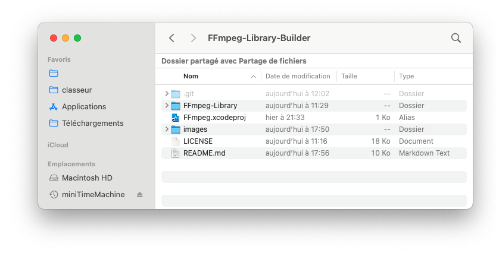
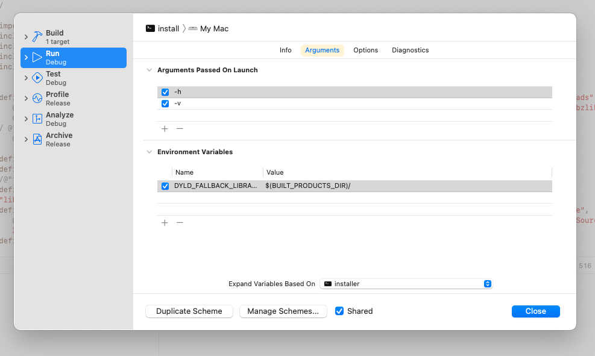
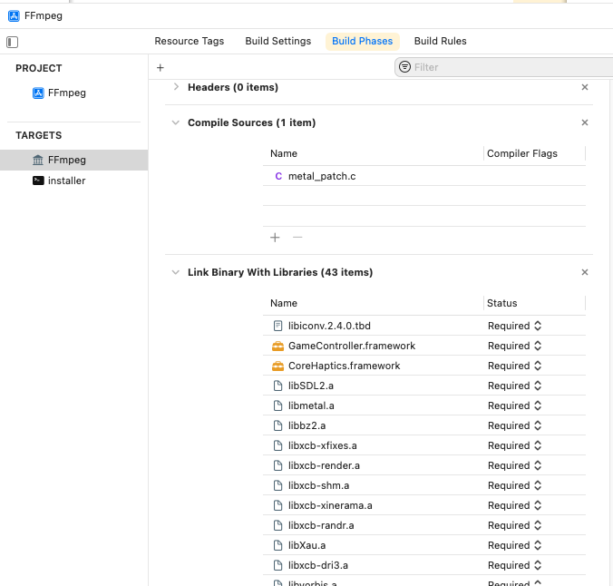
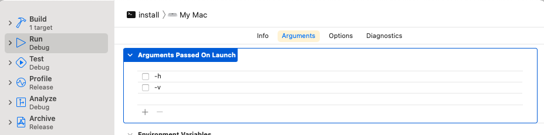
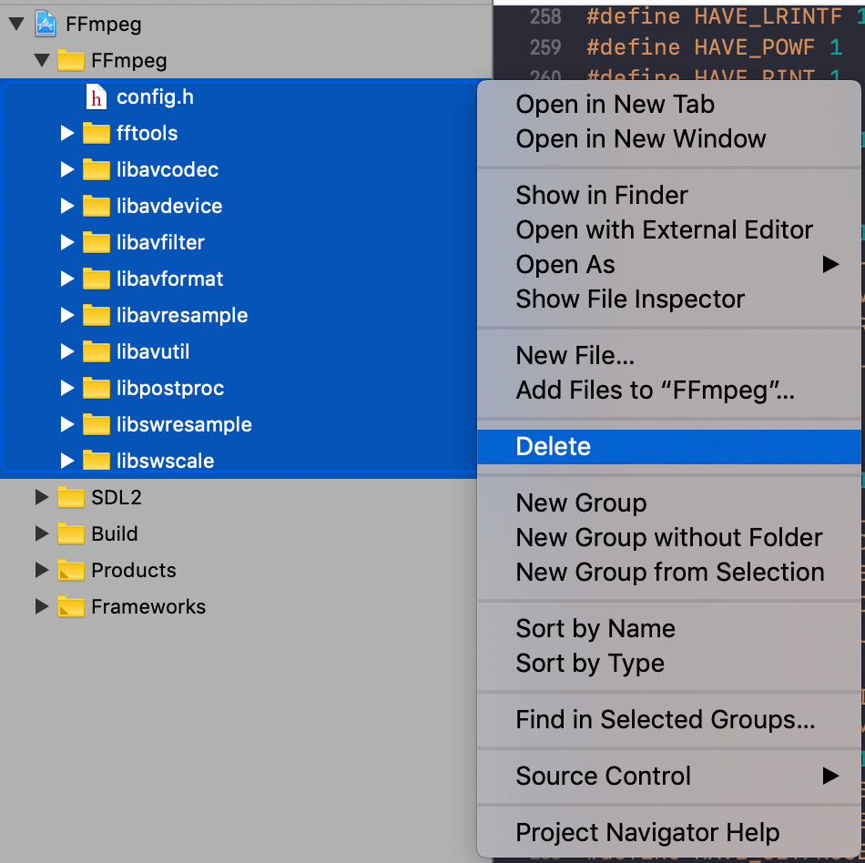
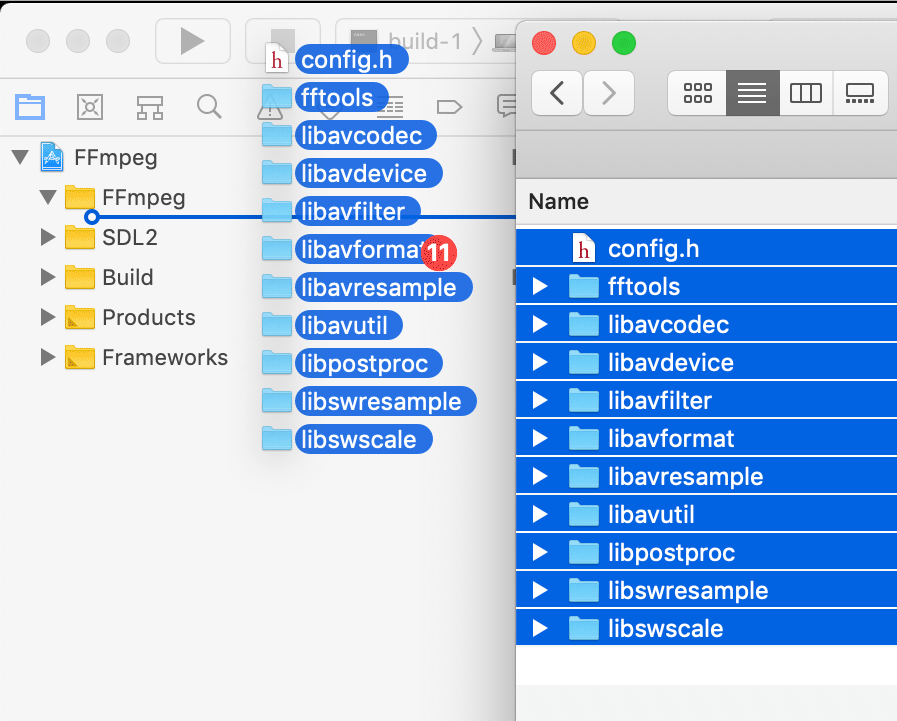

 © Macaplix 2022
# FFmpeg Library Builder


FFmpeg Library Builder is a utility to automatically build a static self contained library, libFFmpeg.a, that includes all of ffmpeg sub-librairies ( libavutil, libavformat, libpostproc... ) from the latest source or any other source you provide.

This program is heavily based upon FFmpeg-in-Xcode project from Single, which it's meant to improve, available at: <https://github.com/libobjc/FFmpeg-in-Xcode>

## FFmpeg Xcode project

The root folder called *FFmpeg-Library-Builder* will be the working directory where intermediate and final library files will end up at some point.

For now it just contains the project folder, called **FFmpeg-Library**, this **README.md** file, a directory **images** with its auxiliary pictures and a convenience alias to the Xcode project file **FFmpeg.xcodeproj**



If you wish to provide an other version of ffmpeg than the release version available at <https://ffmpeg.org/releases/ffmpeg-snapshot.tar.bz2> you can place in that folder either a file called **ffmpeg-snapshot.tar.bz2** or either an uncompressed folder **ffmpeg** containing the set of source files with the configure script ( in this last case you need to start installation from step 4 ).  
Otherwise the installer will automatically download and unzip source files from ffmpeg repository.

### FFmpeg project content

The project contains 2 different schemes each one with its own target:

* **install** scheme  
Which will build a command line tool *installer* ( it's target ) that will perform all the necessary steps to add required source files to the second target. The available steps automatically performed starts from downloading source and ends with building the Library and cleaning intermediary files.
  
* **FFmpeg** scheme  
Which will build the static library *libFFmpeg.a* ( the scheme's target ) once the installation is completed

When you first open the project, the Install scheme will be selected with 2 arguments ( -h and -v ) passed on launch:



If you build and run the project (  R ) it will print the detailed ( -v for verbose ) help ( -h ) of the installer program in the console log window.  

### FFmpeg target files

Now that none of ffmpeg sources are added to the *FFmpeg* target, if you go to the Build phase of the target you'll see only a few files belongs to it.   


   
   

#### C file to compile

metal_patch.c is a patch I added to avoid a missing symbol failure when using the Library:   

source file *libavfilter/vf\_yadif\_videotoolbox.m* references *ff\_vf\_yadif\_videotoolbox\_metallib\_data* and *ff\_vf\_yadif\_videotoolbox\_metallib\_len* as extern variables, but the same variables aren't define as non extern anywhere...

So those variables are defined with fake values in *metal\_patch.c* file to prevent the generated library to yell for missing symbols when in use in a project

```
Todo: find a cleaner solution to this issue   

```

#### Linked Librairies

Ffmpeg is using a set of Apple System Frameworks plus some third party C librairies, which depends on the configure options ffmpeg is build with.

The Frameworks are linked as dynamic librairies as they are supposed to be available through the system on any Mac.   
The third party librairies are all compiled binaries I provide to be included in the final library.   
They have not been cross-compiled and they are only build for arm64 architecture ( M1 ship )

```
Todo: provide cross-compiled binaries so the library would run on any Mac
```
## Running the installer

After checking the help page like explained above, you can run the installer without arguments, so the installer can perform all the steps.  
You'll need for that to edit the Xcode scheme *install* (  < ) in order to deactivate arguments -h and -v.  
Uncheck the 2 checkboxes in front of -h, -v and close the scheme editor window.



To launch the installer and perform a complete installation you just need to build and run the *install* scheme (  R )

## Installer man page
```
% installer [-hvqc] [-c=n] [n1-n2] [n]

	-h help. prints this help message

	n1-n2 starts with step number n1 and ends with step number n2
		both steps n1 & n2 are included
		to perform only step n, use n-n
		default is to perform all the steps from 1st to last
	n	using n without "-" will start at step n and continue to the last one

	-v verbose. prints more detailed messages and help

	-q quiet. only prints errors ( on stderr )

	-c clean. cleans intermediary files once Library is build
	
	-c=n cleans intermediary files with clean level n
		default clean level is 2 with -c and 0 without
		0 - don't clean
		1 - clean only unnecessary files
		2 - cleans to rebuild a library with different ./configure settings
		3 - cleans to have source downloaded anew
	
```
In case any automatic step fails, you can perform it manually and have the installer do the remaining steps automatically passing the following step number as argument in the scheme

## Installer steps in detail

All these steps are suppose to perform automatically thanks to the *installer* executable, the following **Manual step** procedures are only provided in case any step fails or if you want to customize further.

### step 1 - Backup and clean FFmpeg source and destination

This step will backup any previous source ffmpeg and project ffmpeg directories if not empty. No files in these directories will be kept to build the library.  
In case you have edited any of these files, and want to use them in the library, you'll need to put them back in place manually from backup after step 4.


 * **Manual step:**

	1 - Remove or rename folder *FFmpeg-Library-Builder/ffmpeg*  
	
	2 - Delete content of folder *FFmpeg-Library-Builder/FFmpeg-Library/FFmpeg*


### step 2 - Download FFmpeg Source

In this step latest source tar.bz2 file is downloaded from ffmpeg website <https://ffmpeg.org> into folder *FFmpeg-Library-Builder*


 * **Manual step:**

	1 - Download file at <https://ffmpeg.org/releases/ffmpeg-snapshot.tar.bz2> 
	
	2 - Put downloaded file **ffmpeg-snapshot.tar.bz2** in folder *FFmpeg-Library-Builder*

### step 3 - Unzip FFmpeg Source

 * **Manual step:**

	Double click on the file **ffmpeg-snapshot.tar.bz2** to unzip and untar in place.

### step 4 - Configure FFmpeg

Runs the configure script in the source folder obtained by previous steps.
The default arguments used to run configure are those listed bellow. If you need different settings, you can either run this step manually or either edit the argument list to be performed automatically in the macro MCX\_CONFIGURE\_ARGUMENTS located in the file installer/MCXInstaller.m  

 * **Manual step:**   
 
 
```
	cd "FFmpeg-Library-Builder/ffmpeg"  
	
	./configure --prefix=FFmpeg-Library-Builder/FFmpeg-Library/FFmpeg \
	--enable-static --disable-shared --enable-gpl --enable-version3 \
	--enable-pthreads --enable-postproc --enable-filters --disable-asm \
	--disable-programs --enable-runtime-cpudetect --enable-bzlib \
	 --enable-zlib --enable-opengl --enable-libvpx \
	 --enable-libspeex --enable-libopenjpeg  
	 
```

### step 5 - Make FFmpeg ( without actually building )

Runs *make* with *-t* ( touch ) argument which only generate empty .o files in place where *make* would normally build the binary files. The library isn't built at this step, it would be unnecessary and time consuming, but the empty files will later give us a clue on what source files are needed, taking in consideration the configuration that was set in previous step.


 * **Manual step:**   


```
	cd "FFmpeg-Library-Builder/ffmpeg"   
	make -t
```
### step 6 - Move source files to Xcode project folder

First make sure there is no files in *FFmpeg-Library-Builder/FFmpeg-Library/FFmpeg* directory and in the corresponding group in Xcode project.    
If this group is still full select all the files, delete them and choose *Move to Trash* instead of the default *Remove Reference* 



 * **Manual step:**

	Run script "build1" from original  Single FFmpeg-in-Xcode project
https://github.com/libobjc/FFmpeg-in-Xcode   
Which consist on:   
 
	**1 -** removing the FFmpeg group physically deleting all the files it contains   
	**2 -** copying any header file in source ffmpeg directory to project folder   
	**3 -** copying any c source file for which make has generated a .o file    
	**4 -** copying extra header file config.h    
	**5 -** removing libavutil/time.h   


### step 7 - Add FFmpeg Sources to Xcode project

 * **Manual step:**

	In Xcode *FFmpeg* project select *FFmpeg* ( empty ) group choose add Files to "FFmpeg" in the File menu, select the FFmpeg folder inside the project folder ( *FFmpeg-Library-Builder/FFmpeg-Library/FFmpeg* ) and click "Add"
	
	

### step 8 - Finish moving & patching source files


 * **Manual step:**

	Run script "build2" from original  Single FFmpeg-in-Xcode project
<https://github.com/libobjc/FFmpeg-in-Xcode>   
Which consist on:   

	**1 -** copying all header files from source ffmpeg directory to project FFmpeg directory   
	
	**2 -** copying any source .c file whose name contains template or list   
	  >  Those files are included in other c files but doesn't need to be compiled separately   
	  
	**3 -** copying source .c file listed in MCX\_NO\_COMPIL\_C\_FILES    
	   
		Those files are also included in other c files but their names doesn't show it!!!
		Todo: get the file list by scanning C files for #include directives
		involving something else than a .h header  


### step 9 - Build FFmpeg Library

 * **Manual step:**

	Select scheme FFmpeg in Xcode project and build Library (  R or B )


